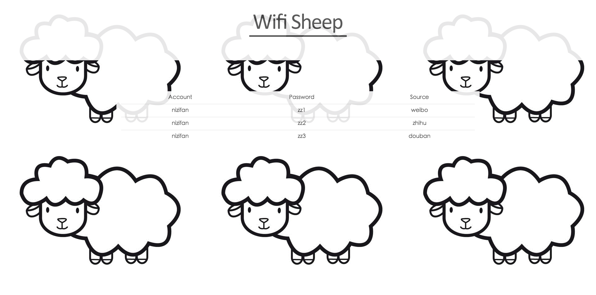

# 预览图

#wifi sheep 绵羊墙

**这是最初的demo版本！会在之后进行优化 **

- [x] 在wifi上安装openwrt
- [x] 用ssh链接wifi执行tcpdump
- [x] 每抓n个包用重定向输入到本地
- [x] 使用pyshark库进行脚本分析
- [x] 抓取其中明文显示的帐号和密码，存入mysql中
- [x] 使用django进行展示
- [x] 然后就可以看见可爱的小羊了！

#运行方法
python3 init.py

# wifiSheep
这是一个示范用的绵羊墙
